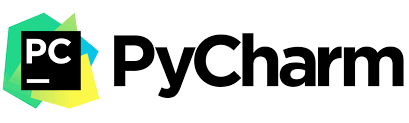

# Hector Chocobar-Torrejon 

[My Website](https://chocobar.net) | [LinkedIn](https://www.linkedin.com/in/hector-chocobar/)

> **BE, CS (UTN, 1994)** |  **Ingeniero en Sistemas (UTN, 1994)**

- Specializations made at University of Michigan in Web Development, Programming, and Data Science.

> **Professor & Senior Mentor**

- 4Geeks Academy Spain, Full Stack Coding Bootcamp Senior Mentor
- UCU, Catholic University of Uruguay, Professor of Programming for Data Analysis 

## Sugerencias y Recomendaciones

- Como Sistema Operativo (SO) te sugiero que utilices alguna distribución Linux. Por ejemplo: [Ubuntu Desktop](https://ubuntu.com/download/desktop).  
- Como Entorno de Desarrollo Integrado (IDE) para desarrolladores Python te recomiendo [PyCharm Community Edition](https://www.jetbrains.com/pycharm/download/#section=linux).

## Repositorios

Estos repositorios están destinados a quienes se inician en la industria del desarrollo de software. En ellos encontrarás código de apoyo de **cursos** que he dictado y de **pequeños proyectos** que utilizo como ejemplos para explicar la implementación de alguna tecnología.
