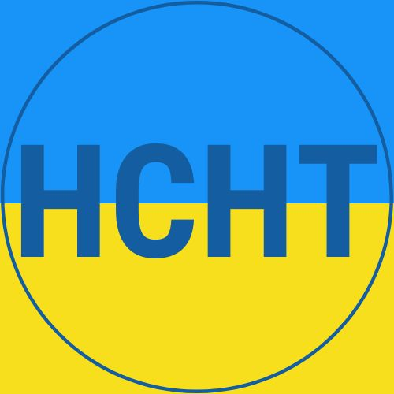
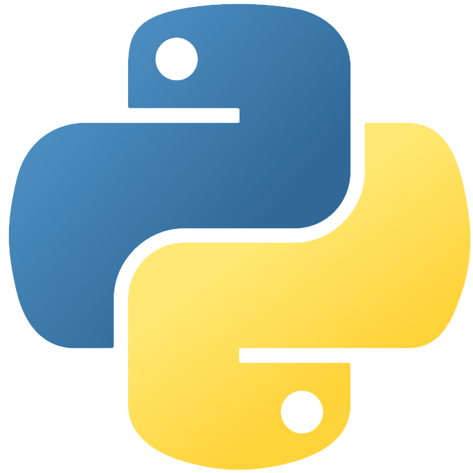
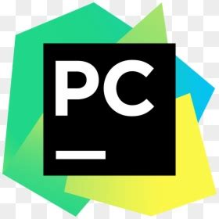
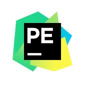
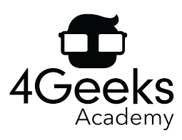

## 🦁 About Me 🦮 🐍

Hi there! I'm Héctor Chocobar Torrejón

I’m a Systems Engineer, university lecturer, and senior mentor in AI Engineering bootcamps. With over 30 years of experience in software and telecom, I’m currently focused on teaching, building data-driven solutions, and mentoring new tech professionals.

### 📫 How to reach me

- 🌐 [chocobar.net](https://chocobar.net)
- 🔗 [LinkedIn](https://www.linkedin.com/in/hector-chocobar/)

## 🚀 What you'll find in this profile:

- Python-based Data Engineering and Data Science projects
- Real-life use cases using Pandas, NumPy, Matplotlib, scikit-learn, etc.
- Jupyter Notebooks and code samples from my university courses and bootcamps
- Web APIs built with Flask and connected to SQL databases
- Web development projects using React + Flask stack
- Exploratory Data Analysis (EDA), Machine Learning, and NLP examples
- Python automation scripts and RegEx use cases

## 🏛️ Education 🎓

> **B.E. in Computer Science** from [UTN - National Technological University](https://www.utn.edu.ar/es/), Córdoba, 🇦🇷 Argentina
> 
> Univesity degree: **"Ingeniero en Sistemas de Información"**.

## 📚 Teaching & Mentorship 🖥️

Passionate about simplifying complexity, sharing knowledge, and building future tech talent

> **Professor & Lecturer** at [Catholic University of Uruguay](https://ucu.edu.uy) in programming and data analysis

- 2026, Programming for Data Analysis & Object-Oriented Programming. 🇺🇾 Uruguay, campus: Salto
- 2026, Prograr desde cero con Python, CEC UCU. 🇺🇾 Uruguay
- 2025, Programming for Data Analysis & Object-Oriented Programming. 🇺🇾 Uruguay, campus: Salto
- 2025, Prograr desde cero con Python, CEC UCU. 🇺🇾 Uruguay
- 2024, Programming for Data Analysis. 🇺🇾 Uruguay, campus: Salto
- 2023, Programming for Data Analysis. 🇺🇾 Uruguay, campus: Salto

> **Senior Mentor** at [4Geeks Academy](https://4geeksacademy.com/) bootcamps (Data Science, Machine Learning, and Full-Stack tracks)

- 2026, AI Engineering Bootcamp. Cohorts: 🇪🇸 Spain-01
- 2025, Data Science & Machine Learning. Cohorts: 🇦🇷 🇨🇴 🇵🇪 🇺🇾 🇻🇪 Latam-10, 🇪🇸 Spain-16, 🇪🇸 Spain-17, 🇪🇸 Spain-20
- 2025, Full Stack Coding Bootcamp. Cohorts: 🇪🇸 Spain-91, 🇪🇸 Spain-93, 🇪🇸 Spain-108, 🇪🇸 Spain-123
- 2024, Full Stack Coding Bootcamp. Cohorts: 🇪🇸 Spain-65, 🇪🇸 Spain-72, 🇪🇸 Spain-77, 🇺🇸 Miami-es-01
- 2023, Full Stack Coding Bootcamp. Cohorts: 🇪🇸 Spain-44, 🇪🇸 Spain-46, 🇪🇸 Spain-50, 🇪🇸 Spain-54
- 2022, Full Stack Coding Bootcamp. Cohorts: 🇪🇸 Madrid-30, 🇪🇸 Madrid-34

## 🌱 Currently learning

- Máster Executive MBA Gadex in Artificial Intelligence

## 💡 Advices 🌞 

- [AWS](https://aws.amazon.com/) as cloud computing
- [Ubuntu](https://ubuntu.com/download/desktop) as Operating System
- [PyCharm](https://www.jetbrains.com/pycharm/download/) as the Python IDE for Professional Developers
- [JetBrians](https://www.jetbrains.com/) as essential tools for software developers and teams

## ❤️ I like it as well 🚀

