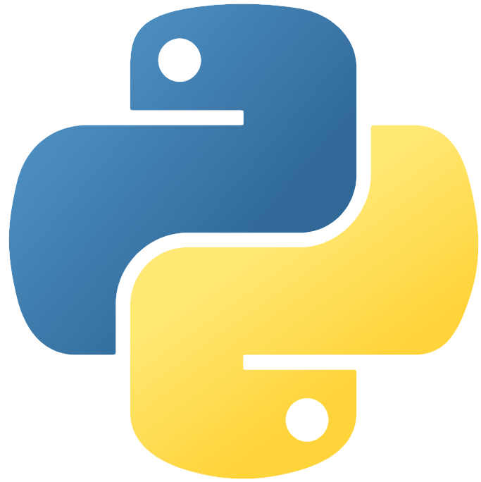
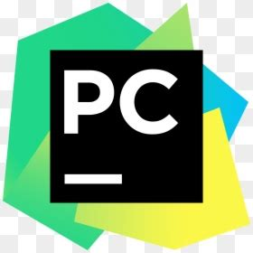
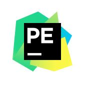

# Héctor Chocobar-Torrejón

## About Me

I’m a Systems Engineer, Python Developer, and Senior Mentor in AI Engineering bootcamps. 

With over 30 years of experience in software and telecom, I’m currently focused on teaching, building data-driven solutions, and mentoring new tech professionals.

**How to reach me:** 🌐 [chocobar.net](https://chocobar.net) | 🔗 [LinkedIn](https://www.linkedin.com/in/hector-chocobar/)

## What you'll find in this profile

- Python-based Data Engineering and Data Science projects
- Real-life use cases using Pandas, NumPy, Matplotlib, scikit-learn, etc.
- Jupyter Notebooks and code samples from my university courses and bootcamps
- Web APIs built with Flask and connected to SQL databases
- Web development projects using React + Flask stack
- Exploratory Data Analysis (EDA), Machine Learning, and NLP examples
- Python automation scripts and RegEx use cases

## Education

> **Bachelor of Engineering in Computer Science** from [UTN - National Technological University](https://www.utn.edu.ar/es/), Córdoba, 🇦🇷 Argentina
> 
> University degree: **'Ingeniero en Sistemas de Información'**
> 
> Currently pursuing Executive MBA in AI and Digital Transformation

## Teaching & Mentorship

Passionate about simplifying complexity, sharing knowledge, and building future tech talent

> **Professor & Lecturer** at [Catholic University of Uruguay](https://ucu.edu.uy) in programming & data with Python
- Programming from scratch with Python.
- Object-Oriented Programming with Python.
- Programming for Data Analysis with Python.

> **Senior Mentor** at [4Geeks Academy](https://4geeksacademy.com/) bootcamps
- AI Engineering Bootcamp (2026 - ...)
- Data Science & Machine Learning (2025 - 2026)
- Full Stack Coding Bootcamp (2022 - 2025)

## Advices

- [AWS](https://aws.amazon.com/) as cloud computing
- [Ubuntu](https://ubuntu.com/download/desktop) as Operating System

## I like it as well

