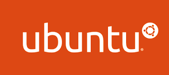

# Hi, my name is Héctor

## 🚀 About Me

Greatiings! I'm Héctor Chocobar Torrejón, Full Stack Developer and Data Science enthusiast 

| [LinkedIn](https://www.linkedin.com/in/hector-chocobar/) | [Website](https://chocobar.net) |

## Education

> **B.E. in Computer Science** | **Ingeniero en Sistemas de Información**, 1994, [UTN](https://www.frc.utn.edu.ar/), Córdoba, 🇦🇷 Argentina

- Specializations in Web Development, 2022, University of Michigan
- Specializations in Programming with Python, 2022, University of Michigan
- Specializations in Data Science, 2022, University of Michigan
- AWS Fundamentals Specialization, 2022, AWS

## Activities

> **Professor** at [UCU - Catholic University of Uruguay](https://ucu.edu.uy), Hybrid, Salto, 🇺🇾 Uruguay

- 2023, Programming for Data Analysis

> **Senior Mentor** at [4Geeks Academy](https://4geeksacademy.com/), Remote, 🇪🇸 Spain

- 2023, Full Stack Coding Bootcamp, Cohorts Spain-44, Spain-46, Spain-50, and Spain-54
- 2022, Full Stack Coding Bootcamp, Cohorts Madrid-30, and Madrid-34

## Advices

- [Ubuntu Desktop](https://ubuntu.com/download/desktop) as Operating System
- [PyCharm Professional](https://www.jetbrains.com/pycharm/download/) as the Python IDE for Professional Developers
